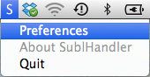

SublimeText 2 URLHandler on OS X
=======================
This is a fork of [asuth/subl-handler](https://github.com/asuth/subl-handler). I moved this application to the Mac status bar, so it is not ocupying Dock now.

This application enables SublimeText 2 to open `subl:` urls, as Textmate has as described [here](http://manual.macromates.com/en/using_textmate_from_terminal#url_scheme_html)

    subl://open/?url=file:///etc/passwd&line=10&column=2

Installation
------------
Download [latest release](http://www.tg.pl/subl-handler/SublHandler.app.zip).

Unzip it, then launch it. Select `S -> Preferences` from the status menu, then set the path for the subl binary.

*Mountain Lion Users*: Because it's an unsigned binary, you'll need to right-click the app and select "Open"... You only need to run it once for the URL handler to register.
*Maverics Users*: Allow apps downloaded from Anywhere from System Preferences -> Security & Privacy -> General. Run it. You only need to run it once.

Test it
-------
Open terminal and type:
    open 'subl://open/?url=file:///etc/hosts'

Uninstalling
------------
Delete following:

    /Applications/SublHandler.app
    ~/Library/Preferences/pl.tg.SublHandler.plist

Authors
-------

* Daisuke Murase :@typester (github, twitter, CPAN, etc..)
* Scott Wadden (SublimeText 2 port)
* Andrew Sutherland (Mountain Lion fixes)
* Tomasz "Grych" Gryszkiewicz <grych@tg.pl> (Status bar)

License
-------

BSD.
